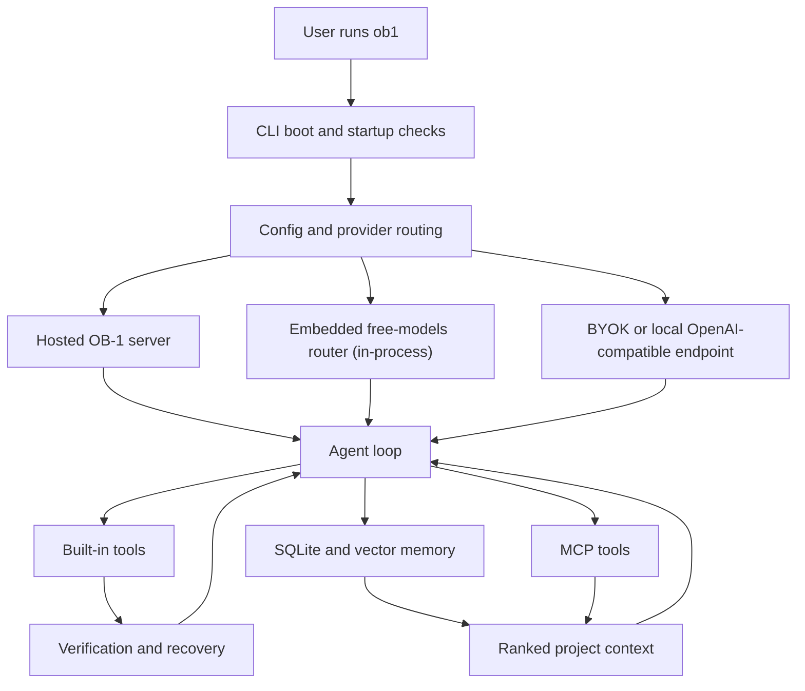

# OB-1 CLI Architecture

This is the contributor map for the large files. Do not start by splitting them; add tests around the
behavior first, then extract narrow pieces when a change needs it.

## System Map

## Boot and Command Routing

`src/index.ts` is the entrypoint. It handles package-manager flags, onboarding, config load, startup
health notes, slash commands, session persistence, and TUI/REPL wiring.

Stable seams:

- Slash commands: command cases in `processLine`.
- Provider/model switching: `setupProvider`, `ensureProvider`, `pickModel`.
- Subscription awareness: `fetchPlan`, `openPricingPage`, `switchToManaged`.
- Session export/resume: `renderConversationMarkdown`, `resumeSession`, `/export`, `/resume`.

## TUI

`src/cli/tui.tsx` owns Ink rendering, list pickers, provider setup forms, prompts, approvals, and footer
state. Keep visual state transitions deterministic and cover them in `scripts/tui-smoke.tsx` or a PTY
test when raw-mode behavior matters.

## Agent Loop and Tools

`src/agent/loop.ts` runs the model/tool cycle. `src/agent/tools.ts` declares tool schemas and tool
wrappers. Browser checks are in `src/agent/browser.ts`; Playwright is optional and loaded lazily.

Stable seams:

- Add a tool in `buildTools`, then cover the wrapper with a smoke.
- Keep provider-neutral prompt rules in `systemPrompt`.
- Verification and self-correction live in `src/agent/verify.ts`.

## Providers

`src/providers/openai.ts` is the only runtime wire implementation. Provider profiles in
`src/providers/profiles.ts` are metadata over OpenAI-compatible endpoints. Add presets there unless a
provider truly needs a new protocol.

Config precedence:

1. Runtime env routes such as `OB1_BASE_URL`, `OPENROUTER_API_KEY`, `OPENAI_API_KEY`, `GEMINI_API_KEY`,
   and `GROQ_API_KEY`.
2. Saved provider profiles from `/models`.
3. Managed OB-1 hosted route.

Env routes are never persisted.

## Memory

`src/memory/store.ts` owns SQLite persistence. `rank.ts`, `evolve.ts`, `reflect.ts`, and `export.ts`
layer retrieval, consolidation, reflection, and graph export over that store. Run memory smokes before
touching schema or retrieval behavior.

## Multi-Agent Modes

`src/multimind/` owns the multi-agent paths. See [Multi-Agent Modes](multimind.md) for behavior; this is
the module map.

- `runtime.ts` — the worker substrate: a headless ReAct loop in an isolated context, plus `runParallel`.
- `worktree.ts` — isolated writable workspace copies (git worktree at HEAD, or a temp-dir copy).
- `evaluate.ts` — the auto verifier signal: `detectSignal` picks the strongest objective signal (test →
  compile gates → none) with zero required env, and `ensembleModels` is the diversity gate.
- `fusion.ts` — Fusion v2: best-of-N generation, then selection-first (similarity vote → smallest diff →
  judge picks); judge-synthesis is the fallback only when nothing passed. Selection helpers are pure/tested.
- `reviewer.ts` — the `/review` refute-reviewer (one read-only worker; findings parsed strictly).
- `deep.ts` — `/deep` AB-MCTS-lite; the Thompson-sampling core (`sampleBeta`/`armPosterior`/`selectArm`) is
  pure and injectable.
- `subagents.ts` / `subagents-write.ts` — read-only decomposition, and opt-in gated parallel edits.
- `apply.ts` — hands a mode's final single-artifact solution to the main gated apply loop.

Verified escalation lives at the boundary: `loop.ts` `shouldEscalate` (pure) decides on a genuine verified
failure, and `index.ts` (`runEscalatedTurn`, `fusionTurn`, `deepTurn`, `reviewTurn`) dispatches it. Reviewer
and deep never write directly; escalation caps at once per turn.

Stable seam: any mode that cannot beat compute-matched Solo@k on the eval suite is deleted — Council,
Personas, the `fanout` orchestrator, the adaptive router, and the orchestration ledger were removed 2026-07
after heterogeneous panels measured harmful (100%→40% accuracy at 29× tokens); see git history. Keep worker
prompts grounded in the same tool/result contract as Solo.

## MCP

`src/mcp/` supports stdio, Streamable HTTP, and legacy SSE. Tool definitions are deferred until needed
so large MCP servers do not inflate every prompt.

## Tests

`scripts/ci-smokes.ts` is the deterministic suite. Live/network checks stay separate and self-skip when
secrets or host capabilities are missing.
